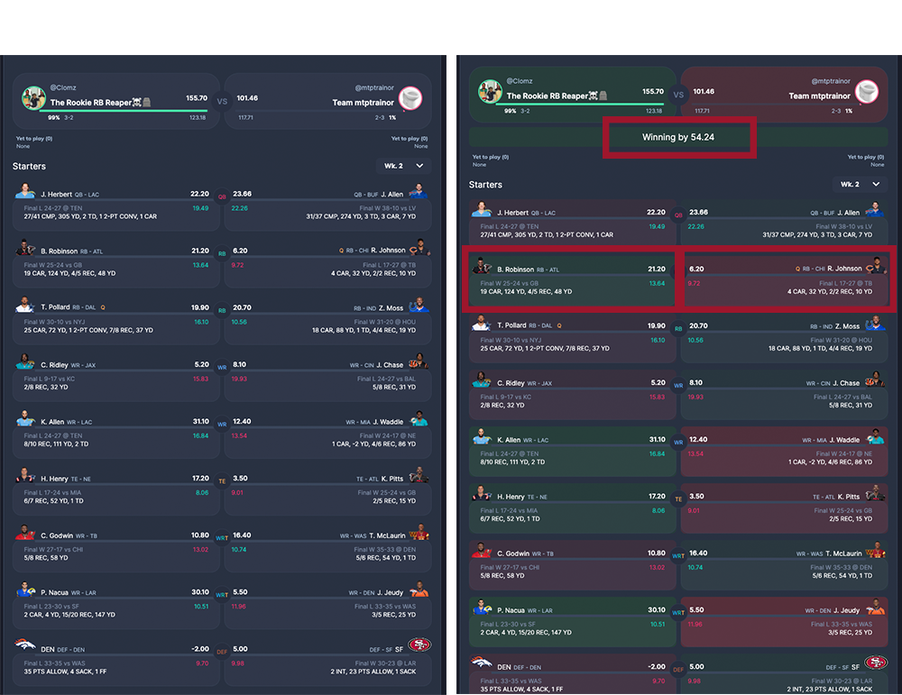

# Sleeper Fantasy Scoreboard Extension🏈📊

Sleeper Fantasy Scoreboard Extension is a Chrome extension that uses simple DOM manipulation to display conditionally formatted updates to your fantasy football scoreboard.

# Link to Download on the Chrome Web Store:
https://chromewebstore.google.com/detail/sleepercom-matchup-extens/bhojnnjccahkfeaalncnjhdhneecdecp

# Description
This extension calculates the difference between your score and your opponents, as well as provides a "heat map" of your players' scoring compared to your opponents.

# Installation via GitHub
1. Clone this repository: `git clone https://github.com/connorsaunders/NFLFantasy_Scoreboard_Extended.git`
2. Open Google Chrome and go to `chrome://extensions/`
3. Enable Developer mode (toggle the button on the top right)
4. Click on `Load Unpacked`
5. Navigate to the cloned repository and select it. The extension should now appear in your extensions list

# Disclaimer
Please note that this extension is independently developed and maintained by Connor Saunders. It is not officially associated with, endorsed by, or directly affiliated with Sleeper.
